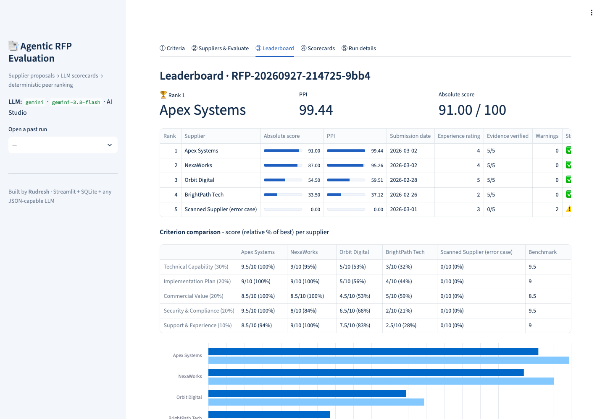
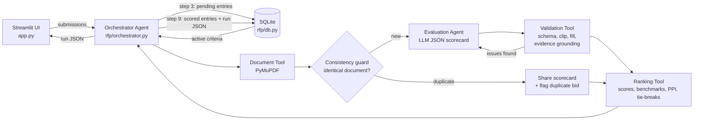
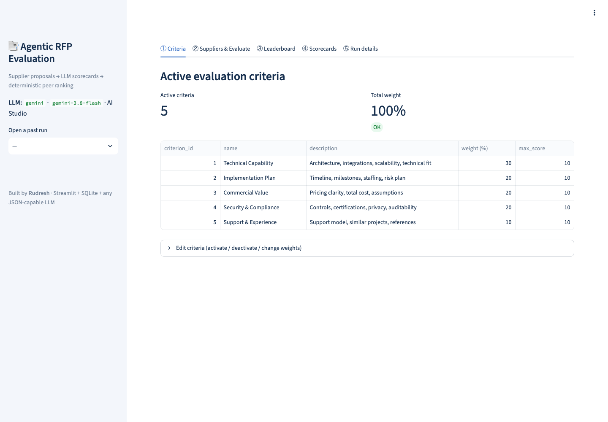
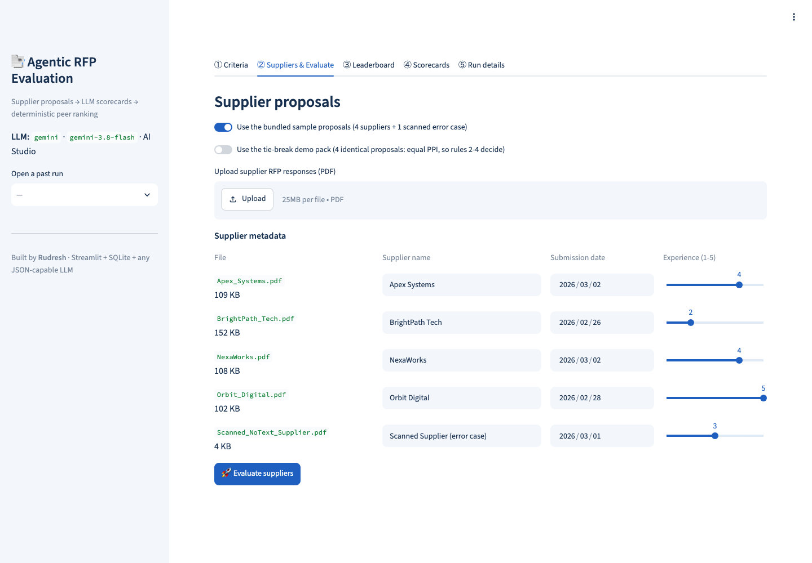
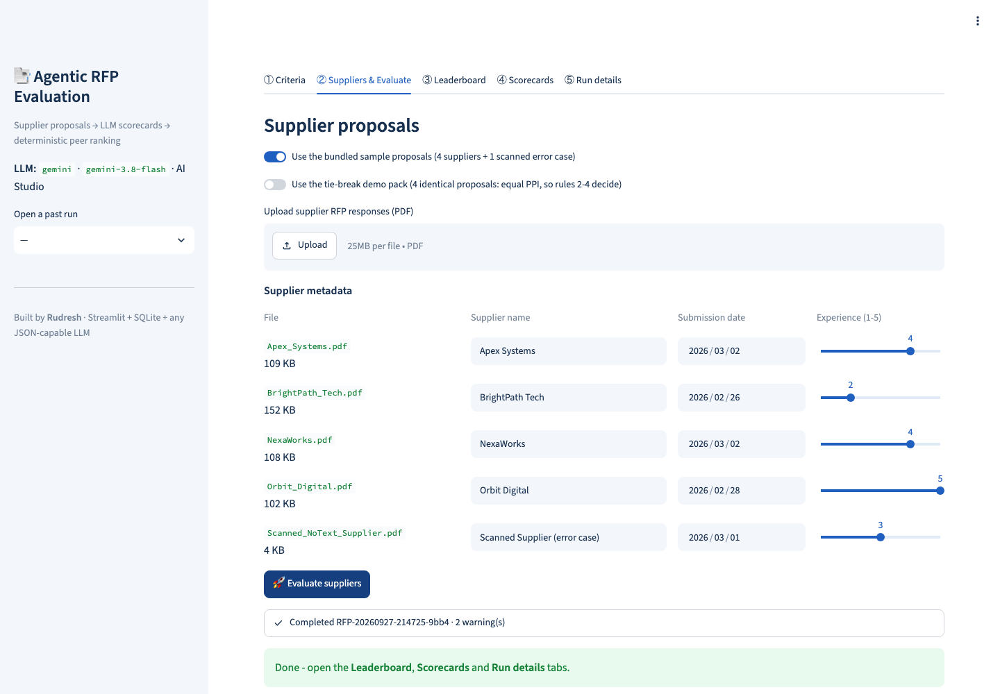
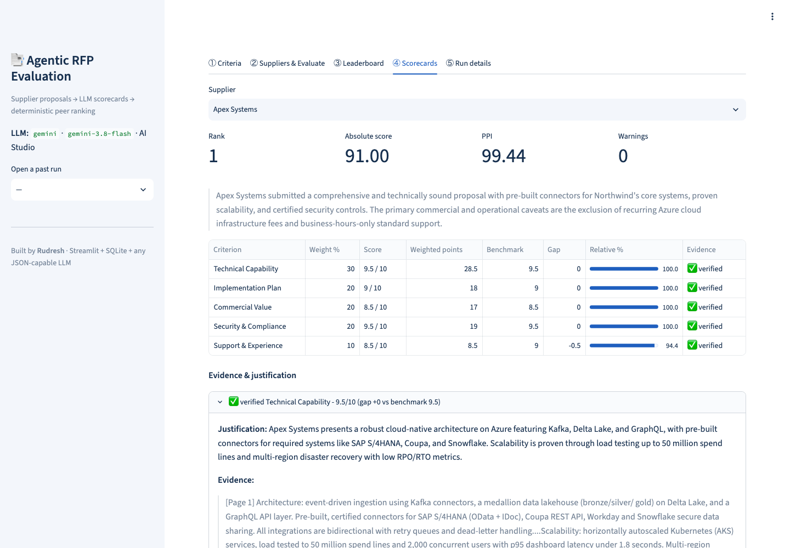
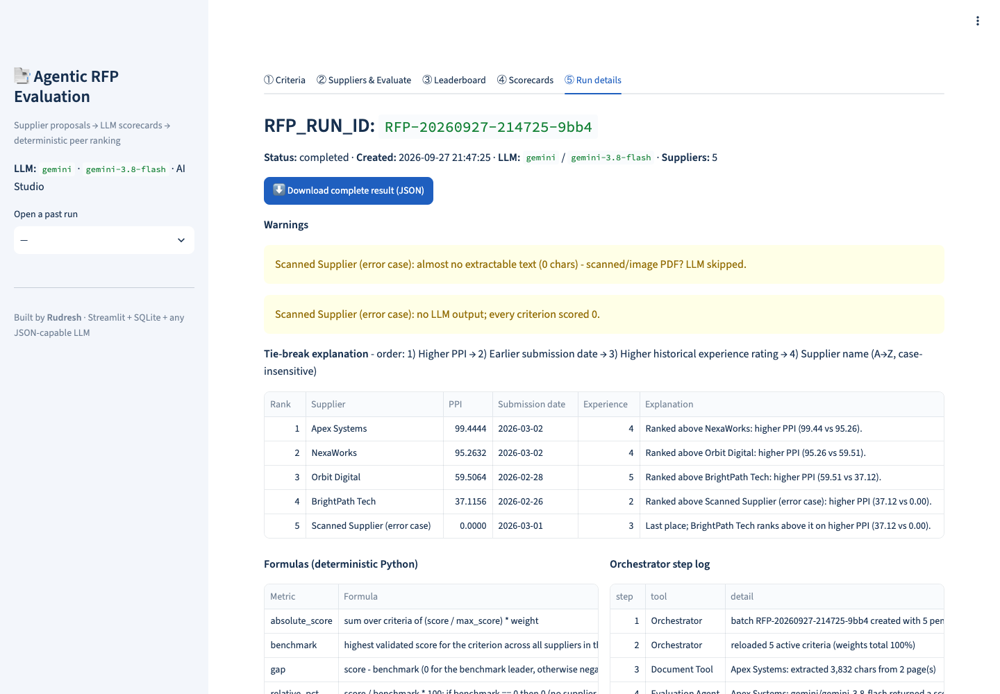
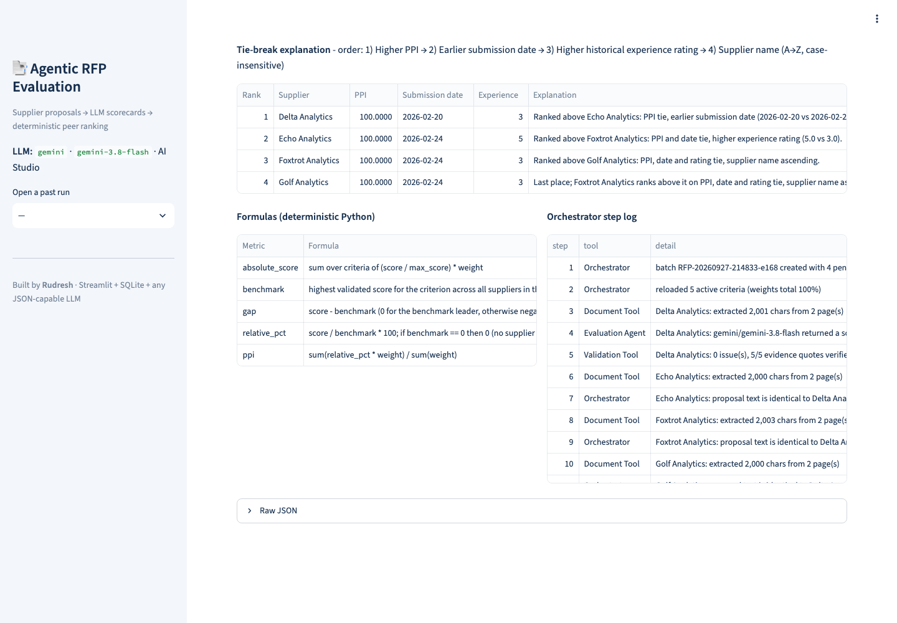
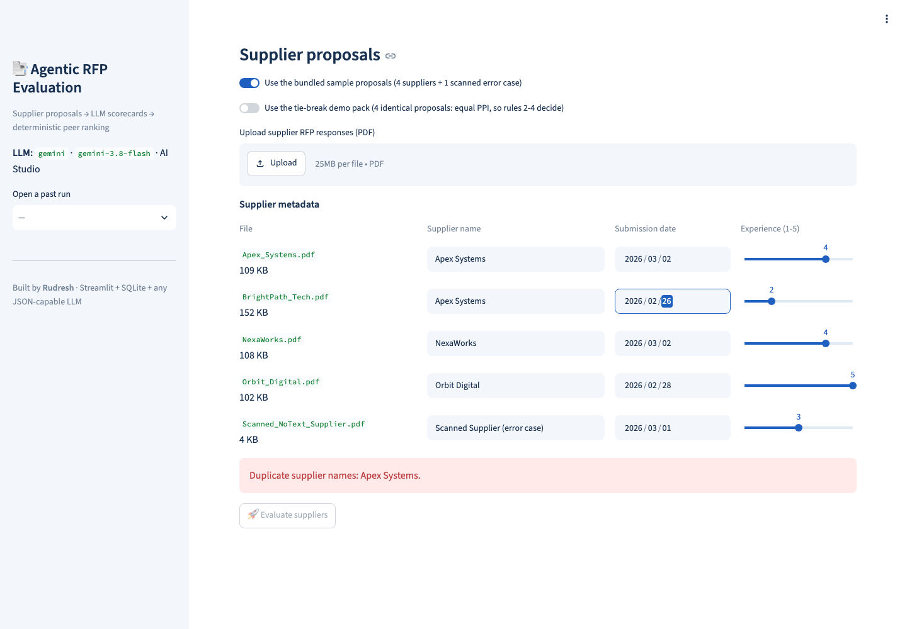
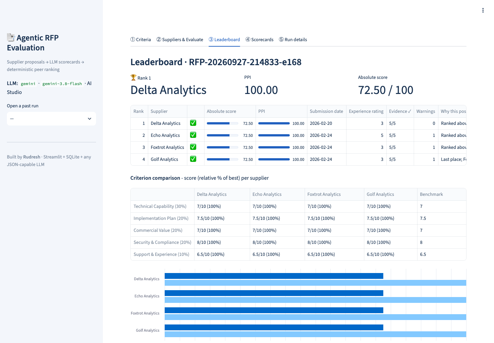

# Agentic RFP Evaluation & Supplier Ranking

**Author:** Rudresh · Classroom mini project (Agentic AI + RFP Evaluation)
**Stack:** Streamlit · SQLite · any JSON-capable LLM (Gemini via AI Studio or Vertex AI, Anthropic, OpenAI, OpenRouter, or a keyless mock)
**Live app:** `https://<your-app>.streamlit.app` (replace after deploying, see [Deploy](#deploy-to-streamlit-community-cloud))
**Source:** https://github.com/RudreshNarwal/Agentic-RFP-Evaluation-and-Supplier-Ranking

The app reads supplier RFP proposals (PDF). An LLM agent scores each proposal against criteria stored in SQLite and quotes
evidence, and the quotes are **verified against the PDF text**. **Deterministic Python** then validates the scorecards,
computes weighted scores, benchmarks suppliers against their peers, applies the mandatory tie-break rules, ranks them,
persists the run and presents an explainable leaderboard.

> The LLM only judges proposal content. It never does the arithmetic, the benchmarking, the tie-breaks or the ranking.



---

## Architecture



| Component | File | Responsibility |
|---|---|---|
| Orchestrator Agent | `rfp/orchestrator.py` | Validates inputs; creates the batch (`RFP_RUN_ID`) and one `pending` supplier entry each; reloads criteria and re-checks that the weights total 100%; calls the tools in order; evaluates distinct documents in parallel; logs every tool call; persists the run or marks it `failed`. |
| Document Tool | `rfp/document_tool.py` | Extracts clean, `[Page N]`-tagged text (PyMuPDF, ligatures expanded). Scanned or corrupt PDFs become warnings. |
| Consistency guard | `rfp/orchestrator.py` (`_fingerprint`) | Hashes each document with the supplier's own name masked. Identical proposals are evaluated **once** and share the scorecard, because LLMs are not deterministic even at temperature 0. The duplicates are flagged as a possible duplicate or collusive bid. |
| Evaluation Agent | `rfp/evaluation_agent.py` | Builds the prompt from the **active DB criteria** (nothing hard-coded) and asks for one JSON result per criterion, with verbatim, page-tagged evidence. **Self-correction:** if the Validation Tool reports issues, the agent is re-prompted once with exactly those issues, and the answer with fewer issues is kept. |
| LLM adapters | `rfp/llm.py` | Gemini (AI Studio, or Vertex AI via `GEMINI_USE_VERTEX_AI`), Anthropic, OpenAI and OpenRouter, with **schema-enforced JSON** where the provider supports it. There is also a keyless mock for tests. |
| Validation Tool | `rfp/validation.py` | Pydantic schema checks. Fills missing criteria, clips out-of-range scores, and drops unknown or duplicate IDs. Takes `max_score` from the DB, never from the LLM. **Evidence grounding:** checks that every quote actually appears in the PDF. Every fix is recorded as a warning. |
| Ranking Tool | `rfp/ranking.py` | Pure, deterministic Python: all formulas, peer benchmarks, tie-breaks, ranks and "why this position" explanations. |
| Persistence | `rfp/db.py` | Schema, criteria CRUD, run and supplier results. |

### Data flow (brief section 4)
1 Setup → 2 Input → **3 Batch** (`RFP-YYYYMMDD-HHMMSS-xxxx` + a `pending` supplier entry each) → **4 Evaluate** (reload
criteria, extract, consistency guard, prompt, LLM) → **5 Validate** (schema + grounding, one self-correction round) →
6 Score → 7 Benchmark → 8 Rank → **9 Persist** (entries become `scored` and the run JSON is saved, in one transaction) →
10 Present + JSON download.

---

## Formulas

| Metric | Formula |
|---|---|
| Absolute weighted score | Σ (score / max_score) × weight → 0..100, because active weights total 100 |
| Criterion benchmark | Highest validated score for that criterion across all suppliers in the run |
| Criterion gap | score − benchmark (0 for the leader, otherwise negative) |
| Relative performance % | score / benchmark × 100. **If benchmark = 0**, meaning no supplier showed anything for the criterion, then relative % = **0** for everyone. There is no peer credit, the criterion can't change the order, and a batch where everything failed can't show a "perfect" PPI of 100. |
| Peer Performance Index (PPI) | Σ (relative % × weight) / Σ weight |

**Mandatory tie-break order:** 1) higher PPI → 2) earlier submission date → 3) higher experience rating → 4) supplier name A→Z
(case-insensitive). Ranks 1, 2, 3… are assigned only after this sort. PPI is rounded to 4 decimals *before* comparing, so
float noise can't break a genuine tie. Every supplier gets a plain-English note naming the rule that placed it.

**Worked example** (`sample_output/run_example_gemini.json`, Apex Systems): scores 9.5, 9, 8.5, 9.5, 7.5 out of 10 with
weights 30/20/20/20/10 give absolute = 28.5 + 18 + 17 + 19 + 7.5 = **90.0**. The benchmarks are 9.5, 9, 8.5, 9.5, 9.5, so the relative %
values are 100, 100, 100, 100, 78.95 and PPI = (100·90 + 78.95·10) / 100 = **97.89**.

**Tie-break demo** (`sample_output/run_tiebreak_demo_gemini.json`): four identical proposals get PPI 100 each.
Rule 2 puts Delta (submitted 20 Feb) above Echo (24 Feb). Rule 3 puts Echo (rating 5) above Foxtrot (rating 3). Rule 4 puts
Foxtrot above Golf (alphabetical).

---

## SQLite design

| Table | Fields |
|---|---|
| `evaluation_criteria` | criterion_id, name, description, weight, max_score, is_active |
| `rfp_runs` | rfp_run_id, created_at, status (`running` / `completed` / `failed`), llm_provider, llm_model, warnings_json, run_json |
| `supplier_results` | rfp_run_id (FK), supplier_name, submission_date, experience_rating, source_file, status (`pending` / `scored` / `failed`), absolute_score, ppi, final_rank, result_json |

Supplier entries are created as `pending` at step 3, filled in and set to `scored` at step 9, or set to `failed` if the run
crashes. Foreign keys are enforced. The seeded criteria are Technical Capability 30%, Implementation Plan 20%, Commercial
Value 20%, Security & Compliance 20% and Support & Experience 10%, all with max score 10. You can edit them in the
**Criteria** tab; saving is refused unless the active weights total 100%, and the prompt picks up the change automatically.

---

## Setup (local)

Requires Python 3.11+ (3.12 recommended).

```bash
python -m venv .venv && source .venv/bin/activate
pip install -r requirements.txt
python seed_db.py                 # create data/rfp.db + seed criteria (--reset to start over)
python generate_sample_pdfs.py    # (re)create the synthetic proposals in sample_pdfs/
cp .streamlit/secrets.toml.example .streamlit/secrets.toml   # add your key (never commit this file)
streamlit run app.py
```

With no key, the app runs in **mock mode**, a deterministic keyword heuristic, so it still works offline and for the tests.

| Variable | Values / purpose |
|---|---|
| `LLM_PROVIDER` | `gemini` \| `anthropic` \| `openai` \| `openrouter` \| `mock` (the default when unset) |
| `LLM_MODEL` | Optional override. Defaults: `gemini-3.8-flash`, `claude-sonnet-5`, `gpt-5-mini`, `anthropic/claude-sonnet-5` |
| `GOOGLE_API_KEY` | Gemini key (`GEMINI_API_KEY` also accepted) |
| `GEMINI_USE_VERTEX_AI` | `false` → Google AI Studio. `true` → Vertex AI: express mode with `GOOGLE_API_KEY`, or `GOOGLE_CLOUD_PROJECT` + `GOOGLE_CLOUD_LOCATION` with Application Default Credentials |
| `ANTHROPIC_API_KEY` / `OPENAI_API_KEY` / `OPENROUTER_API_KEY` | Key for the chosen provider |
| `RFP_DB_PATH` | Optional SQLite path (default `data/rfp.db`) |

A Vertex AI key must have the **Vertex AI API** allowed in its API restrictions (Google Cloud Console → APIs & Services →
Credentials → your key). Otherwise Google returns `403 API_KEY_SERVICE_BLOCKED`.
Temperature is set to 0 for Gemini. Claude Sonnet 5 and the GPT-5 models don't accept a temperature setting, so
reproducibility comes from the consistency guard and from storing every validated scorecard.

## Tests

```bash
pytest -q
```

29 tests, covering:
- **Ranking:** hand-computed scores, benchmarks and PPI; zero-benchmark handling; every tie-break level; case-insensitive names; float-noise ties; order independence.
- **Validation:** malformed and fenced JSON; missing, unknown and duplicate criteria; non-numeric, out-of-range and `null` fields; missing evidence; evidence grounding (real quotes accepted, invented ones flagged).
- **Pipeline:** determinism; step-3 entries marked `failed` on a crash; the self-correction loop fixing a bad first answer; identical proposals sharing one scorecard so rules 2–4 decide; scanned and corrupt PDFs; LLM outage; invalid inputs and non-ISO dates rejected before a run is created.
- **UI:** a Streamlit `AppTest` run of the full flow.

---

## Synthetic RFP documents (`sample_pdfs/`)

Four fictional 2-page responses to *RFP-2026-017: Cloud Procurement Analytics Platform for Northwind Retail Group*. Each
includes an executive summary, the solution and approach, timeline/team/milestones, a price table with assumptions,
security/compliance/risk, and support/experience/references.

| Supplier | Profile | Real Gemini result |
|---|---|---|
| Apex Systems | Strong technical design and security (ISO 27001, SOC 2 Type II); highest price ($1.34M); moderate 20-week plan | Rank 1 · Tech 9.5, Security 9.5 |
| NexaWorks | Balanced ($895K); strongest implementation plan (RACI, risk register) and 24x7 SLA support | Rank 2 · Support 9.5 (best) |
| Orbit Digital | 40+ deployments and named references; integration "to be finalised"; medium, estimated price ($965K) | Rank 3 · Tech 5 (vague integration) |
| BrightPath Tech | Lowest price ($370K), fastest (12 weeks); vague compliance, no risk plan, founded 2024 | Rank 4 · Security 3 |
| `Scanned_NoText_Supplier.pdf` | Image-only PDF, the **error case** | Warning, scored 0, ranked last |
| `tiebreak_demo/*` | Four **identical** proposals from four names | Shared scorecard; tie-break rules 2, 3 and 4 decide |

Sample exported JSON (real Gemini runs): [`run_example_gemini.json`](sample_output/run_example_gemini.json) and
[`run_tiebreak_demo_gemini.json`](sample_output/run_tiebreak_demo_gemini.json).

## Validation and error handling

| Situation | Behaviour |
|---|---|
| Active weights ≠ 100%, no files, blank or duplicate supplier names (case-insensitive), non-ISO date, rating outside 1-5 | Shown in the UI; Evaluate is disabled; no run is created |
| Criteria edited between upload and evaluation | Re-checked after the reload at step 4; the run is marked `failed` |
| Scanned/empty PDF, corrupt file | Warning; LLM skipped; supplier flagged ⚠️, scored 0, ranked last; the run still completes |
| LLM API error or refusal | Warning; supplier zero-filled and flagged; other suppliers unaffected |
| Invalid JSON, missing/unknown/duplicate criterion, non-numeric/out-of-range/`null` score, missing or **unverifiable evidence** | Repaired (fill 0 / drop / keep first / clip) and warned; the issues are sent back to the Evaluation Agent for one self-correction round |
| Identical proposals from different suppliers | Evaluated once, scorecard shared, flagged for review |
| All suppliers failed | Run-level warning; PPI is 0 for everyone rather than a misleading 100 |

## Assumptions

- Scores are per criterion on 0..max_score (default 10). Weights are percentages of the active set.
- Submission date and experience rating (1-5) are entered by the user; the LLM never sets them.
- Evidence grounding compares lowercase alphanumeric words, so punctuation, line breaks and page tags don't matter. Quotes may join separate passages with "...". Each passage needs at least 3 words.
- Documents longer than 80,000 characters are truncated for the LLM, with a warning.
- Proposals are untrusted input. The prompt tells the model to treat them as data and to flag embedded instructions as risks. Scores are clipped to range and all the maths stays in Python.
- Streamlit Community Cloud storage is ephemeral: the DB is re-created and re-seeded on restart. Download the run JSON to keep results.

---

## Screenshots (real Gemini runs)

| | |
|---|---|
|  Criteria |  Supplier input |
|  Run completed |  Scorecard, verified evidence |
|  Run details and warnings |  Tie-break rules 2–4 |
|  Validation error (duplicate name) |  Tie-break leaderboard |

---

## Deploy to Streamlit Community Cloud

1. Go to [share.streamlit.io](https://share.streamlit.io), sign in with GitHub, and click **Create app** → **Deploy a public app from GitHub**.
2. Repository `RudreshNarwal/Agentic-RFP-Evaluation-and-Supplier-Ranking`, branch `main`, main file `app.py`. Pick a custom subdomain.
3. **Advanced settings** → Python **3.12** → Secrets:
   ```toml
   LLM_PROVIDER = "gemini"
   LLM_MODEL = "gemini-3.8-flash"
   GEMINI_USE_VERTEX_AI = false
   GOOGLE_API_KEY = "your-key"
   ```
4. Click **Deploy**, then replace the live-app placeholder at the top of this README with the URL.

## Project structure

```
app.py                    Streamlit UI (5 screens)
rfp/                      orchestrator, tools, agents, db
seed_db.py                DB creation + seed script
generate_sample_pdfs.py   synthetic supplier PDFs
sample_pdfs/              4 proposals + scanned error case + tiebreak_demo/
sample_output/            exported run JSON (real Gemini runs)
tests/                    pytest suite (29 tests)
docs/screenshots/         README images
```
