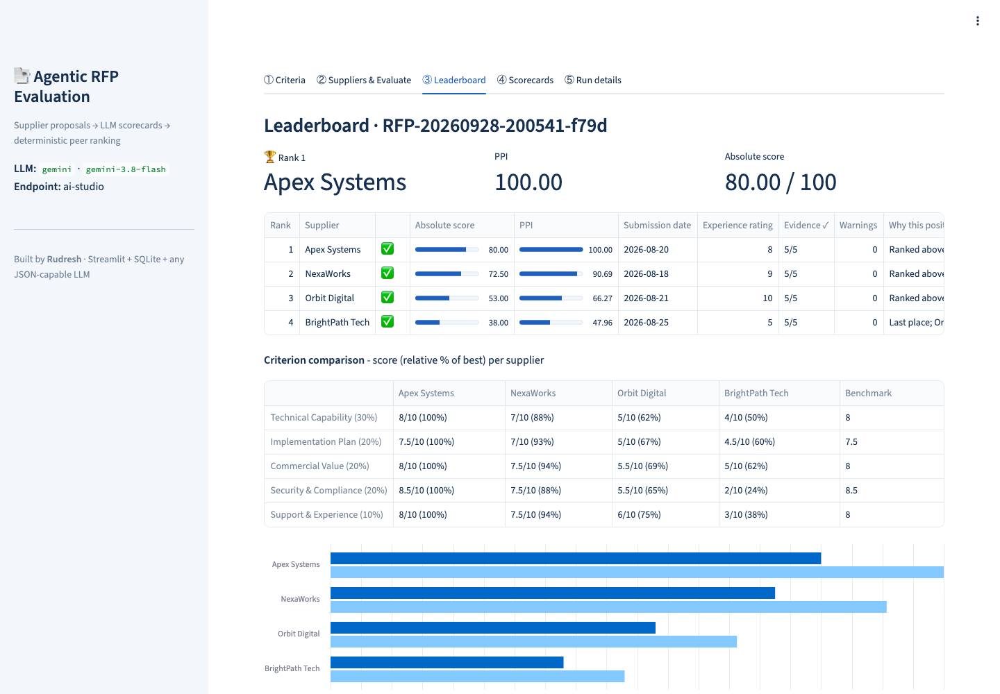
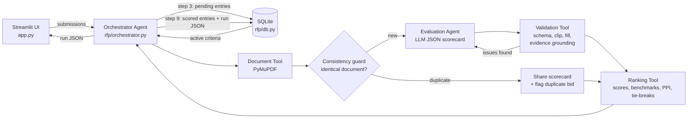
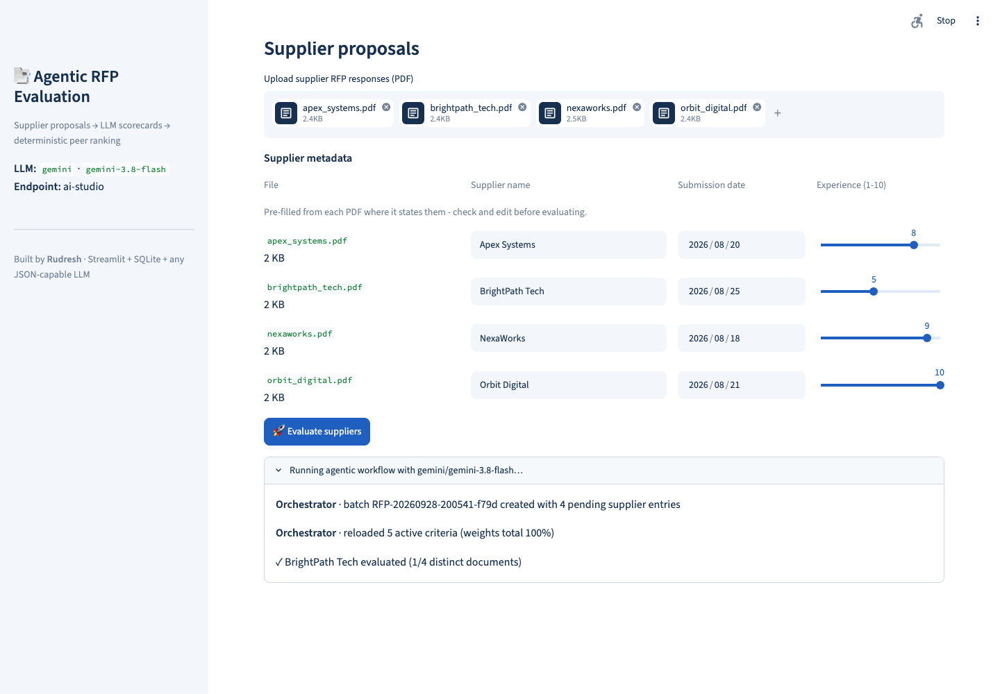
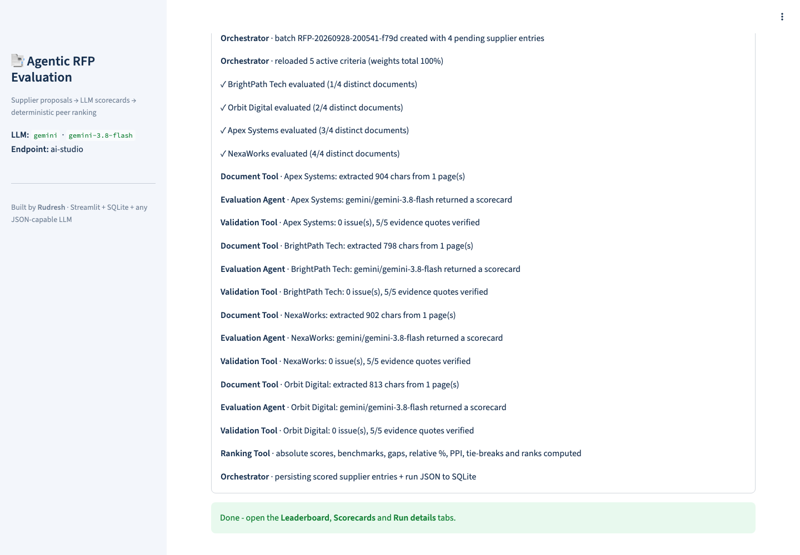
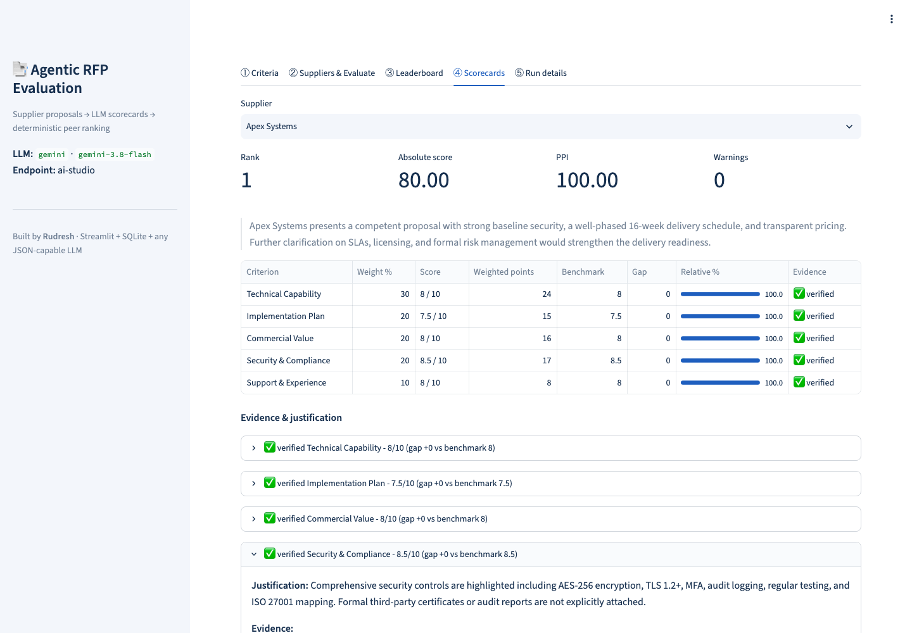
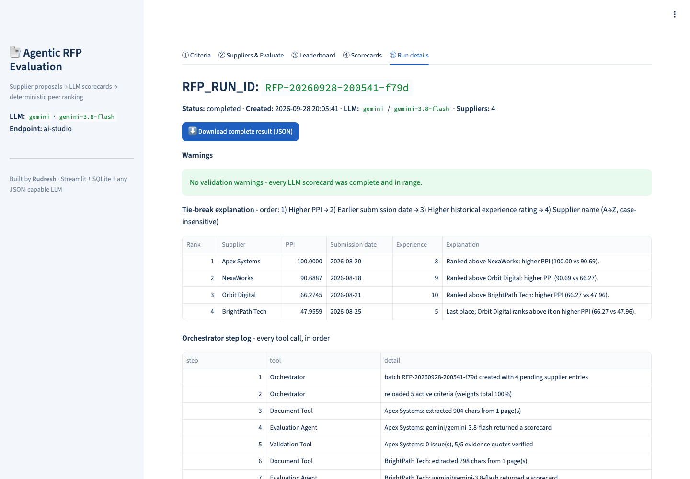

# Agentic RFP Evaluation & Supplier Ranking

**Author:** Rudresh · Classroom mini project (Agentic AI + RFP Evaluation)
**Stack:** Streamlit · SQLite · any JSON-capable LLM (Gemini via AI Studio or Vertex AI, Anthropic, OpenAI, OpenRouter, or a keyless mock)
**Live app:** `https://<your-app>.streamlit.app` (replace after deploying, see [Deploy](#deploy-to-streamlit-community-cloud))
**Source:** https://github.com/RudreshNarwal/Agentic-RFP-Evaluation-and-Supplier-Ranking
**Demo video:** `<add link>` (one successful run + validation/error cases, see [Demo video](#demo-video))

The app reads supplier RFP proposals (PDF). An LLM agent scores each proposal against criteria stored in SQLite and quotes
evidence, and the quotes are **verified against the PDF text**. **Deterministic Python** then validates the scorecards,
computes weighted scores, benchmarks suppliers against their peers, applies the mandatory tie-break rules, ranks them,
persists the run and presents an explainable leaderboard.

> The LLM only judges proposal content. It never does the arithmetic, the benchmarking, the tie-breaks or the ranking.



---

## Architecture



| Component | File | Responsibility |
|---|---|---|
| Orchestrator Agent | `rfp/orchestrator.py` | Validates inputs; creates the batch (`RFP_RUN_ID`) and one `pending` supplier entry each; reloads criteria and re-checks that the weights total 100%; calls the tools in order; evaluates distinct documents in parallel; logs every tool call; persists the run or marks it `failed`. |
| Document Tool | `rfp/document_tool.py` | Extracts clean, `[Page N]`-tagged text (PyMuPDF, ligatures expanded). Pre-fills supplier name, submission date and experience rating when the PDF states them. Scanned or corrupt PDFs become warnings. |
| Consistency guard | `rfp/orchestrator.py` (`_fingerprint`) | Hashes each document with the supplier's own name masked. Identical proposals are evaluated **once** and share the scorecard, because LLMs are not deterministic even at temperature 0. The duplicates are flagged as a possible duplicate or collusive bid. |
| Evaluation Agent | `rfp/evaluation_agent.py` | Builds the prompt from the **active DB criteria** (nothing hard-coded) and asks for one JSON result per criterion, with verbatim, page-tagged evidence. **Self-correction:** if the Validation Tool reports fixable issues, the agent is re-prompted once with exactly those issues. The repair is kept only if it is better on substance: more criteria validly answered, then more verified quotes, then fewer issues. |
| LLM adapters | `rfp/llm.py` | Gemini (AI Studio, or Vertex AI via `GEMINI_USE_VERTEX_AI`, with an automatic, reported fallback to AI Studio if Vertex rejects the key), Anthropic, OpenAI and OpenRouter, with **schema-enforced JSON** where the provider supports it. Reads a local `.env`. There is also a keyless mock for tests. |
| Validation Tool | `rfp/validation.py` | Pydantic schema checks. Fills missing criteria, clips out-of-range scores, and drops unknown or duplicate IDs. Takes `max_score` from the DB, never from the LLM. **Evidence grounding:** checks that every quote actually appears in the PDF, on the page it cites. Every fix is recorded as a warning. |
| Ranking Tool | `rfp/ranking.py` | Pure, deterministic Python: all formulas, peer benchmarks, tie-breaks, ranks and "why this position" explanations. |
| Persistence | `rfp/db.py` | Schema, criteria CRUD, run and supplier results. |

### Data flow (brief section 4)
1 Setup → 2 Input → **3 Batch** (`RFP-YYYYMMDD-HHMMSS-xxxx` + a `pending` supplier entry each) → **4 Evaluate** (reload
criteria, extract, consistency guard, prompt, LLM) → **5 Validate** (schema + grounding, one self-correction round) →
6 Score → 7 Benchmark → 8 Rank → **9 Persist** (entries become `scored` or `failed` and the run JSON is saved, in one transaction) →
10 Present + JSON download.

---

## Formulas

| Metric | Formula |
|---|---|
| Absolute weighted score | Σ (score / max_score) × weight → 0..100, because active weights total 100 |
| Criterion benchmark | Highest validated score for that criterion across all suppliers in the run |
| Criterion gap | score − benchmark (0 for the leader, otherwise negative) |
| Relative performance % | score / benchmark × 100. **If benchmark = 0**, meaning no supplier showed anything for the criterion, then relative % = **0** for everyone. There is no peer credit, the criterion can't change the order, and a batch where everything failed can't show a "perfect" PPI of 100. |
| Peer Performance Index (PPI) | Σ (relative % × weight) / Σ weight |

**Mandatory tie-break order:** 1) higher PPI → 2) earlier submission date → 3) higher experience rating → 4) supplier name A→Z
(case-insensitive). Ranks 1, 2, 3… are assigned only after this sort. PPI is rounded to 4 decimals *before* comparing, so
float noise can't break a genuine tie. Every supplier gets a plain-English note naming the rule that placed it.

**Worked example** (live Gemini run `RFP-20260928-200541-f79d`, NexaWorks): scores 7, 7, 7.5, 7.5, 7.5 out of 10 with
weights 30/20/20/20/10 give absolute = 21 + 14 + 15 + 15 + 7.5 = **72.5**. The benchmarks are 8, 7.5, 8, 8.5, 8 (all set by
Apex), so the relative % values are 87.5, 93.33, 93.75, 88.24, 93.75 and
PPI = (87.5·30 + 93.33·20 + 93.75·20 + 88.24·20 + 93.75·10) / 100 = **90.69**. Apex leads every criterion, so its PPI is 100.

Tie-break rules 2–4 (date → rating → name) are exercised in the test suite, including four identical proposals submitted
under different names (`tests/test_pipeline_mock.py`).

---

## SQLite design

| Table | Fields |
|---|---|
| `evaluation_criteria` | criterion_id, name, description, weight, max_score, is_active |
| `rfp_runs` | rfp_run_id, created_at, status (`running` / `completed` / `failed`), llm_provider, llm_model, warnings_json, run_json |
| `supplier_results` | rfp_run_id (FK), supplier_name, submission_date, experience_rating, source_file, status (`pending` / `scored` / `failed`), absolute_score, ppi, final_rank, result_json |

Supplier entries are created as `pending` at step 3, filled in and set to `scored` at step 9, or set to `failed` if that
supplier couldn't be evaluated (or the whole run crashed). Foreign keys are enforced. The seeded criteria are Technical Capability 30%, Implementation Plan 20%, Commercial
Value 20%, Security & Compliance 20% and Support & Experience 10%, all with max score 10. You can edit them in the
**Criteria** tab; saving is refused unless the active weights total 100%, and the prompt picks up the change automatically.

---

## Setup (local)

Requires Python 3.11+ (3.12 recommended).

```bash
python -m venv .venv && source .venv/bin/activate
pip install -r requirements.txt
python seed_db.py                 # create data/rfp.db + seed criteria (--reset to start over)
cp .env.example .env              # add your key (.env is gitignored, never commit it)
streamlit run app.py
```

Configuration is read from real environment variables first, then `.env`, then Streamlit secrets (used on Streamlit Cloud).
With no key, the app runs in **mock mode**, a deterministic keyword heuristic, so it still works offline and for the tests.

| Variable | Values / purpose |
|---|---|
| `LLM_PROVIDER` | `gemini` \| `anthropic` \| `openai` \| `openrouter` \| `mock` (the default when unset) |
| `LLM_MODEL` | Optional override. Defaults: `gemini-3.8-flash`, `claude-sonnet-5`, `gpt-5-mini`, `anthropic/claude-sonnet-5` |
| `GOOGLE_API_KEY` | Gemini key (`GEMINI_API_KEY` also accepted) |
| `GEMINI_USE_VERTEX_AI` | `false` → Google AI Studio. `true` → Vertex AI: express mode with `GOOGLE_API_KEY`, or `GOOGLE_CLOUD_PROJECT` + `GOOGLE_CLOUD_LOCATION` with Application Default Credentials |
| `ANTHROPIC_API_KEY` / `OPENAI_API_KEY` / `OPENROUTER_API_KEY` | Key for the chosen provider |
| `RFP_DB_PATH` | Optional SQLite path (default `data/rfp.db`) |

A Vertex AI key must have the **Vertex AI API** allowed in its API restrictions (Google Cloud Console → APIs & Services →
Credentials → your key). Otherwise Google returns `403 API_KEY_SERVICE_BLOCKED`. In that case the app keeps working by using
Google AI Studio with the same key. It records `backend: ai-studio` in the run and shows a warning in the sidebar and in Run details.
Temperature is set to 0 for Gemini. Claude Sonnet 5 and the GPT-5 models don't accept a temperature setting, so
reproducibility comes from the consistency guard and from storing every validated scorecard.

## Tests

```bash
pytest -q
```

38 tests, covering:
- **Ranking:** hand-computed scores, benchmarks and PPI; zero-benchmark handling; every tie-break level; case-insensitive names; float-noise ties; order independence.
- **Validation:** malformed and fenced JSON; missing, unknown and duplicate criteria; non-numeric, out-of-range and `null` fields; missing evidence; evidence grounding (real quotes accepted; invented quotes and wrong `[Page N]` tags flagged).
- **Pipeline:** determinism; step-3 entries marked `failed` on a crash and failed suppliers stored as `failed`; the self-correction loop (a fixed answer is accepted, a worse one rejected, a repair of invalid JSON kept, blank evidence alone never triggers a repair); whole-word name masking; identical proposals sharing one scorecard so rules 2–4 decide; scanned and corrupt PDFs; LLM outage; invalid inputs and non-ISO dates rejected before a run is created.
- **UI:** a Streamlit `AppTest` run that uploads the four sample PDFs, checks the pre-filled names and ratings, and evaluates; metadata extraction.
- **LLM config:** `.env` loading (real env vars win) and the Vertex → AI Studio fallback with its warning.

---

## Sample RFP documents (`sample_pdfs/`)

Four fictional, 1-page supplier responses (prices in INR). Each states its own submission date and historical experience
rating out of 10, which the app pre-fills on upload.

| Supplier (file) | Stated in the PDF | Profile | Real Gemini result |
|---|---|---|---|
| Apex Systems (`apex_systems.pdf`) | 2026-08-20 · 8/10 | Strong architecture and security controls; INR 48 lakh + 8 lakh/yr | Rank 1 · leads every criterion (PPI 100, absolute 80.0) |
| NexaWorks (`nexaworks.pdf`) | 2026-08-18 · 9/10 | Balanced; detailed milestones and support model; INR 31 lakh + 6 lakh/yr | Rank 2 · PPI 90.69 |
| Orbit Digital (`orbit_digital.pdf`) | 2026-08-21 · 10/10 | Strong experience; interface mapping deferred until after award; INR 35 lakh + 6.5 lakh/yr | Rank 3 · Tech 5 (vague integration) |
| BrightPath Tech (`brightpath_tech.pdf`) | 2026-08-25 · 5/10 | Cheapest and fastest (8 weeks); security claims without certifications or evidence | Rank 4 · Security 2 |

The complete result of any run, including every scorecard, is exported from **Run details → Download complete result (JSON)**.

## Validation and error handling

| Situation | Behaviour |
|---|---|
| Active weights ≠ 100%, no files, blank or duplicate supplier names (case-insensitive), non-ISO date, rating outside 1-10 | Shown in the UI; Evaluate is disabled; no run is created |
| Criteria edited between upload and evaluation | Re-checked after the reload at step 4; the run is marked `failed` |
| Scanned/empty PDF, corrupt file | Warning; LLM skipped; supplier flagged ⚠️, scored 0, ranked last; the run still completes |
| LLM API error or refusal | Warning; supplier zero-filled and flagged; other suppliers unaffected |
| Invalid JSON, missing/unknown/duplicate criterion, non-numeric/out-of-range/`null` score, missing or **unverifiable evidence** | Repaired (fill 0 / drop / keep first / clip) and warned; the issues are sent back to the Evaluation Agent for one self-correction round |
| Identical proposals from different suppliers | Evaluated once, scorecard shared, flagged for review |
| All suppliers failed | Run-level warning; PPI is 0 for everyone rather than a misleading 100 |

## Assumptions

- Scores are per criterion on 0..max_score (default 10). Weights are percentages of the active set.
- Supplier name, submission date and experience rating (1-10) are pre-filled from the PDF text when stated (for example "Submission date: 2026-08-20", "Historical experience rating: 8/10"), and the user confirms or edits them. The LLM never sets them.
- Evidence grounding compares lowercase alphanumeric words, so punctuation, line breaks and page tags don't matter. Quotes may join separate passages with "...". Each passage needs at least 3 words.
- Documents longer than 80,000 characters are truncated for the LLM, with a warning.
- Proposals are untrusted input. The prompt tells the model to treat them as data and to flag embedded instructions as risks. Scores are clipped to range and all the maths stays in Python.
- Streamlit Community Cloud storage is ephemeral: the DB is re-created and re-seeded on restart. Download the run JSON to keep results.

---

## Screenshots (real Gemini runs)

| | |
|---|---|
|  Criteria |  Upload, metadata pre-filled from the PDFs |
|  Agentic workflow running (live progress) |  Run completed, every tool call logged |
|  Leaderboard |  Scorecard, verified evidence |
|  Run details, tie-breaks, JSON download | |

---

## Deploy to Streamlit Community Cloud

1. Go to [share.streamlit.io](https://share.streamlit.io) and sign in with GitHub. The repository is **private**, so grant
   Streamlit access to private repositories when asked.
2. Click **Create app** → deploy from GitHub: repository `RudreshNarwal/Agentic-RFP-Evaluation-and-Supplier-Ranking`,
   branch `main`, main file `app.py`. Pick a custom subdomain.
3. **Advanced settings** → Python **3.12** → Secrets:
   ```toml
   LLM_PROVIDER = "gemini"
   LLM_MODEL = "gemini-3.8-flash"
   GEMINI_USE_VERTEX_AI = false  # AI Studio key; set true only with a key allowed on Vertex AI
   GOOGLE_API_KEY = "your-key"
   ```
4. Click **Deploy**. An app from a private repository starts out private, so open **Share** and make it **public** so graders can open it.
5. Replace the live-app placeholder at the top of this README with the URL.

## Demo video

Record the live app (about 3–4 minutes):

1. **Criteria:** show the 5 criteria totalling 100%. Set a weight to 40 and click **Save** to show the "must total 100%" error, then undo.
2. **Input + validation error:** upload the 4 PDFs from `sample_pdfs/` and show that name, date and rating are pre-filled. Rename one supplier to a duplicate to show the error and the disabled button, then fix it.
3. **Successful run:** click **Evaluate** and let the progress messages show each tool running.
4. **Leaderboard:** ranks, absolute score, PPI, criterion comparison.
5. **Scorecard:** benchmarks, gaps, ✅ verified evidence and the justification for each score.
6. **Run details:** `RFP_RUN_ID`, warnings, tie-break explanations, step log and formulas; download the JSON.
7. **Error case (optional):** upload a PDF with no text layer (e.g. a scan) to show it flagged ⚠️, scored 0 and ranked last.

## Submission checklist (brief section 10)

| Item | Where |
|---|---|
| Source code, folder structure, `requirements.txt` | This repository ([project structure](#project-structure)) |
| SQLite creation/seed script with sample criteria | `seed_db.py` (schema and seed in `rfp/db.py`) |
| At least four synthetic supplier PDFs | `sample_pdfs/` (4 fictional proposals) |
| Deployed app on Streamlit Community Cloud | Live-app link at the top |
| README: setup, architecture, formulas, assumptions, screenshots | This file |
| Sample exported JSON for one completed run | Export from **Run details → Download complete result (JSON)** and include it with the submission |
| Short demo: one successful run + validation/error case | Demo-video link at the top |

## Known limitations

- LLM judgments vary between calls, even at temperature 0. Two runs on the same proposals give slightly different scores (the ranking in the sample runs stayed the same). Every run stores the exact validated scorecards it used, so its results can always be traced and reproduced.
- The self-correction round is covered by tests but didn't trigger in the live sample runs, because Gemini's first answers had no validation issues.
- The consistency guard gives identical proposals a single shared evaluation, rather than examining each copy independently. This is deliberate and each shared scorecard is flagged with a warning.
- Evidence grounding checks that quotes exist on the cited page, not that they support the score. That judgment stays with the LLM, and the justification is shown next to each score.
- Mock mode is a keyword heuristic for offline use and tests only; its scores and evidence are not meaningful.

## Project structure

```
app.py                    Streamlit UI (5 screens)
rfp/                      orchestrator, tools, agents, db
seed_db.py                DB creation + seed script
sample_pdfs/              4 fictional supplier proposals
tests/                    pytest suite (38 tests)
docs/screenshots/         README images
```
